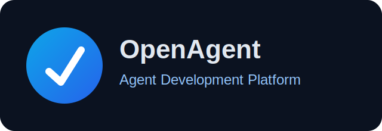
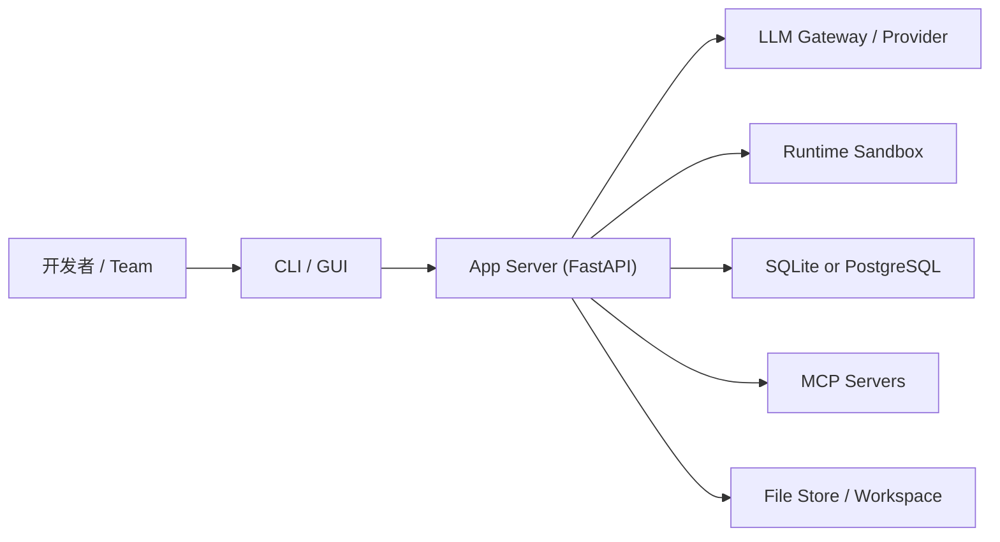

<a name="readme-top"></a>

<div align="center">
  
  <h1 align="center" style="border-bottom: none">openagent-platform</h1>
</div>

<p align="center">
面向研发团队的智能开发平台（CLI / GUI / SDK / Self-Hosted）。
</p>

<div align="center">
  
  
  
  
</div>

---

## 目录

- [1. 项目定位](#1-项目定位)
- [2. 与原版区别](#2-与原版区别)
- [3. 功能全景](#3-功能全景)
- [4. 架构总览](#4-架构总览)
- [5. 项目结构](#5-项目结构)
- [6. 快速开始](#6-快速开始)
- [7. 配置说明（DB / Redis / Ollama / LLM）](#7-配置说明db--redis--ollama--llm)
- [8. 部署方式](#8-部署方式)
- [9. 重构与演进建议](#9-重构与演进建议)
- [10. 依赖治理](#10-依赖治理)
- [11. 安全与运维基线](#11-安全与运维基线)
- [12. FAQ](#12-faq)
- [13. 协议与声明](#13-协议与声明)

---

## 1. 项目定位

`OpenAgent Platform` 是一个以“智能研发执行链路”为核心的工程平台，覆盖以下能力：

- Agent 任务执行（命令、编辑、代码生成、运行验证）
- 多模型接入（OpenAI 兼容网关、Ollama、本地与云端模型）
- 多运行形态（CLI、Local GUI、容器运行、Kubernetes）
- 可扩展工具接入（MCP）与会话状态管理

该仓库的目标是提供可长期维护、可二次开发、可团队化部署的智能体工程骨架。

---

## 2. 与原版区别

本仓库基于上游 OpenHands 进行品牌化与工程化改造，已完成的差异包括：

1. 文档改为中文主叙述，中英结合标题。
2. 顶部 Logo、仓库命名与品牌元数据改为统一中性命名。
3. 新增 `.env.fork.example` 与 `.env.local.example`，集中管理 DB/Redis/Ollama/LLM 配置。
4. `docker-compose.yml` 与 `containers/dev/compose.yml` 支持镜像名、容器名参数化。
5. `config.template.toml` 补充非 localhost 的生产配置示例。
6. 新增 fork 深改清单（每项目 50+ 项）：`docs/fork-customization-roadmap.zh-CN.md`。

上游参考：

- Upstream Repo: [OpenHands/OpenHands](https://github.com/OpenHands/OpenHands)

> **非官方声明（Non-Affiliation）**
> 本仓库为社区维护的衍生/二次开发版本，与上游项目及其权利主体不存在官方关联、授权背书或从属关系。
> **商标声明（Trademark Notice）**
> 相关项目名称、Logo 与商标归其各自权利人所有。本仓库仅用于说明兼容/来源，不主张任何商标权利。

---

## 3. 功能全景

### 3.1 运行模式

- `CLI Mode`：终端驱动，适合脚本化与流水线。
- `Local GUI`：可视化会话与调试。
- `Container Runtime`：隔离执行环境。
- `Kubernetes Runtime`：团队化部署与弹性扩展。

### 3.2 平台能力

- 模型配置：`model`、`base_url`、`api_key`、重试与超时
- 会话与轨迹：会话上下文、轨迹回放
- 外部扩展：MCP（SSE/SHTTP/stdio）
- 持久化：SQLite（默认）/ PostgreSQL（生产）

---

## 4. 架构总览



---

## 5. 项目结构

```text
.
├── README.md
├── .env.fork.example
├── .env.local.example
├── LICENSE
├── LICENSE-OPENAGENT-COMMUNITY.md
├── config.template.toml
├── docker-compose.yml
├── docs/
├── frontend/
├── openhands/
├── openhands-ui/
├── enterprise/
└── tests/
```

---

## 6. 快速开始

### 6.1 环境要求

- Python `3.12+`
- Node.js `22+`
- Docker `24+`

### 6.2 容器启动

```bash
cp .env.fork.example .env
# 修改 LLM_API_KEY / LLM_BASE_URL 等关键项

docker compose up -d --build
```

### 6.3 源码启动（示例）

```bash
# backend
poetry install

# frontend
cd frontend
npm install
npm run dev
```

---

## 7. 配置说明（DB / Redis / Ollama / LLM）

建议优先维护 `.env.fork.example`：

- `LLM_MODEL` / `LLM_API_KEY` / `LLM_BASE_URL`
- `OLLAMA_BASE_URL`
- `DB_HOST` / `DB_PORT` / `DB_NAME` / `DB_USER` / `DB_PASS`
- `REDIS_HOST` / `REDIS_PORT` / `REDIS_PASSWORD`
- `OPENHANDS_IMAGE_NAME` / `OPENHANDS_CONTAINER_NAME`

---

## 8. 部署方式

### 8.1 单机 Docker Compose

适合开发与 PoC 场景。

### 8.2 Kubernetes

适合团队生产场景，建议配置：

- Ingress + TLS
- Secret 管理
- 资源请求/限制
- 日志与监控

---

## 9. 重构与演进建议

建议按三阶段推进：

1. 品牌层：命名、Logo、README、仓库描述。
2. 配置层：环境模板、密钥治理、配置校验。
3. 架构层：模块重构、依赖升级策略、CI 完整化。

详细清单见：`docs/fork-customization-roadmap.zh-CN.md`。

---

## 10. 依赖治理

- 每周处理安全补丁（patch）
- 每月评估次版本（minor）
- 每季度评估主版本（major）
- 升级前后均执行 smoke test 与回归测试

---

## 11. 安全与运维基线

- 禁止提交真实密钥
- 生产环境禁用弱口令
- 外网统一 HTTPS
- 关键操作记录审计日志
- 设置模型调用预算与限流

---

## 12. FAQ

### Q1：是否必须立刻修改所有包名与命名空间？

不必须。建议先完成文档与配置层改造，再进行代码级全量 rename。

### Q2：如何切换自定义镜像仓库？

在 `.env` 中配置：

- `AGENT_SERVER_IMAGE_REPOSITORY`
- `AGENT_SERVER_IMAGE_TAG`
- `OPENHANDS_IMAGE_NAME`

### Q3：是否支持离线/半离线部署？

支持。可通过私有制品仓库与私有镜像仓库进行离线发布。

---

## 13. 协议与声明

- 原始开源许可证：见 [LICENSE](LICENSE)
- 社区补充协议：见 [LICENSE-OPENAGENT-COMMUNITY.md](LICENSE-OPENAGENT-COMMUNITY.md)

<p align="right">(<a href="#readme-top">回到顶部</a>)</p>

## Baseline Maintenance

### Environment

- Put runtime credentials in environment variables.
- Use `.env.example` as the configuration template.

### CI

- `baseline-ci.yml` provides a unified pipeline with `lint + build + test + secret scan`.

### Repo Hygiene

- Keep generated files (`dist/`, `build/`, `__pycache__/`, `.idea/`, `.DS_Store`) out of version control.
