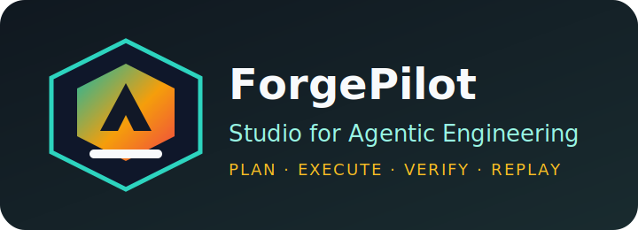
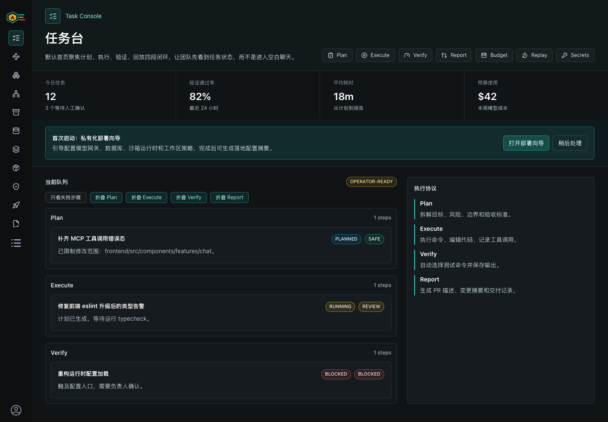
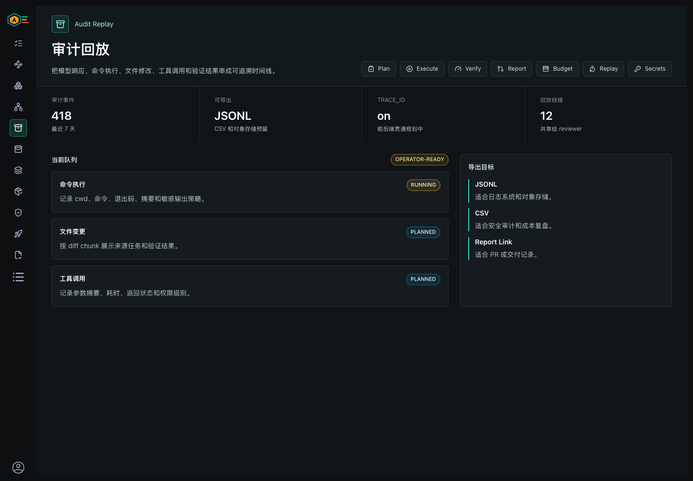
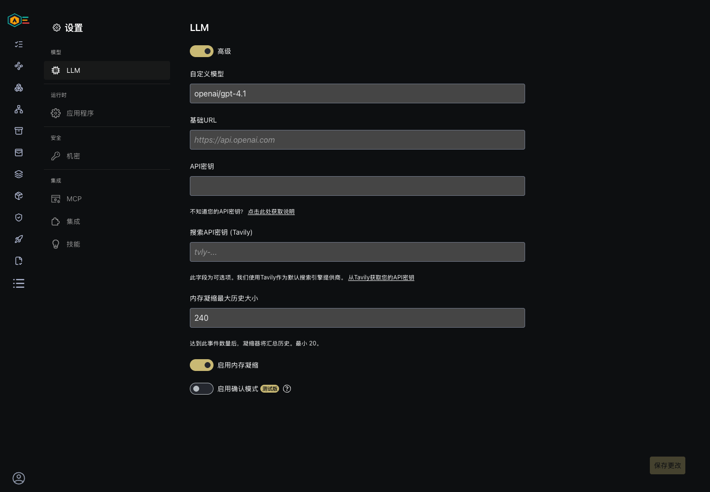
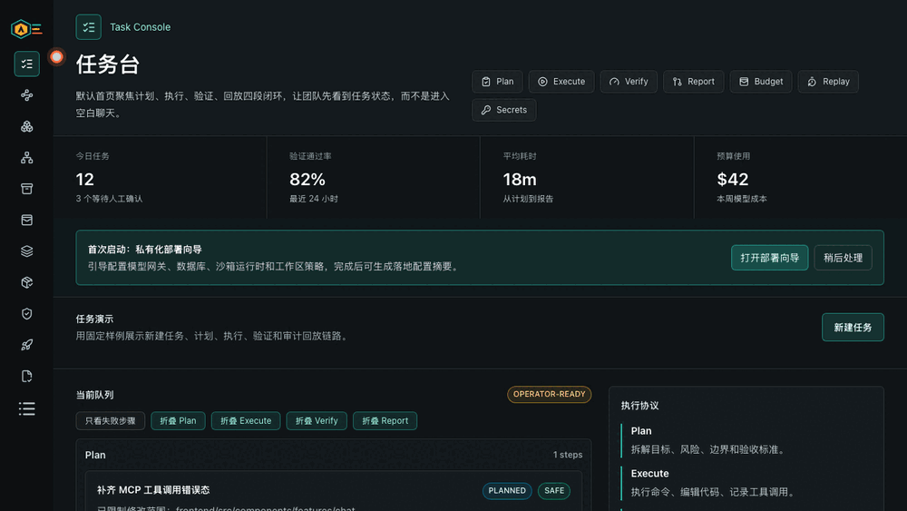
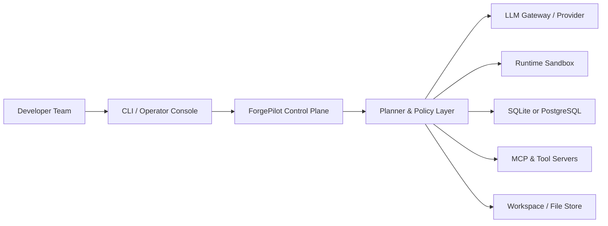

<a name="readme-top"></a>

<div align="center">
  
  <h1 align="center" style="border-bottom: none">ForgePilot Studio</h1>
</div>

<p align="center">
面向研发团队的可审计 AI 工程执行工作台。
</p>

> **Based on [OpenHands](https://github.com/OpenHands/OpenHands), deep-customized with:**
> Control Plane (Plan→Execute→Verify→Report) · Task Console · TeamSpace RBAC · Audit Replay · Cost Thresholds · MCP Tool Registry · Private Deployment

<div align="center">
  
  
  
  
  <br/>
  
</div>

---

## 产品预览

ForgePilot Studio 把“创建任务 → 执行命令 → 修改代码 → 验证测试 → 审计回放”收束成团队可治理的工程执行链路。它基于 OpenHands 深改，继承 Agent 与 runtime 基础，同时新增控制平面、任务台、团队权限、审计回放、成本阈值、MCP 工具管理和私有化配置。

<table>
  <tr>
    <td width="33%">
      
      <br>
      <strong>任务台</strong>
      <br>
      <sub>计划、执行、验证、报告四段闭环，默认展示任务状态而不是空白聊天。</sub>
    </td>
    <td width="33%">
      
      <br>
      <strong>运行日志 / 审计回放</strong>
      <br>
      <sub>模型响应、命令、文件修改、工具调用和验证结果统一进入可追溯时间线。</sub>
    </td>
    <td width="33%">
      
      <br>
      <strong>模型配置</strong>
      <br>
      <sub>支持 OpenAI-compatible gateway、Ollama、本地模型和团队私有网关。</sub>
    </td>
  </tr>
</table>



关键文档：

- [差异说明](docs/fork-differentiation.md)：说明哪些能力来自 OpenHands，哪些是 ForgePilot 新增或深改。
- [上游同步策略](docs/upstream-sync.md)：说明同步策略、保留 `openhands/` 包名的原因、命名空间迁移和冲突处理。
- [模块职责与测试清单](docs/forgepilot-module-map.md)：梳理 `openhands/forgepilot/*` 的职责和测试覆盖。
- [本地模型与网关启动指引](docs/local-models-and-gateways.md)：覆盖 Ollama、LiteLLM、OpenAI-compatible gateway 和 Preview 演示路径。
- [Preview Release 草稿](docs/forgepilot-preview-release.md)：固定“基于 OpenHands 深改”的发布口径和发布前检查项。

## 矩阵角色

`ForgePilot Studio` 是 however-yir AI 工程作品矩阵中的“AI 工程执行工作台”，负责展示基于 OpenHands 深改后的控制平面、任务台、团队权限、审计回放、成本阈值、MCP 工具治理和私有化配置。完整项目矩阵见 [docs/project-matrix.md](docs/project-matrix.md)，面试讲解提纲见 [docs/interview-notes.md](docs/interview-notes.md)。

---

## 目录

- [产品预览](#产品预览)
- [矩阵角色](#矩阵角色)
- [1. 项目定位](#1-项目定位)
- [2. 与上游项目的差异化方向](#2-与上游项目的差异化方向)
- [3. 功能全景](#3-功能全景)
- [4. 架构总览](#4-架构总览)
- [5. 项目结构](#5-项目结构)
- [6. 快速开始](#6-快速开始)
- [7. 配置说明](#7-配置说明)
- [8. 部署方式](#8-部署方式)
- [9. 深度改造路线图](#9-深度改造路线图)
- [10. 依赖治理](#10-依赖治理)
- [11. 安全与运维基线](#11-安全与运维基线)
- [12. FAQ](#12-faq)
- [13. 协议与来源](#13-协议与来源)

---

## 1. 项目定位

`ForgePilot Studio` 是面向研发团队的可审计 AI 工程执行工作台。它以“可审计的智能研发执行链路”为核心，更像团队内部的 AI 工程控制台，而不是单纯的聊天式代码助手。

核心能力：

- 工程任务执行：命令运行、代码编辑、补丁生成、验证闭环。
- 工作流编排：把需求拆成计划、执行、检查、回放四个阶段。
- 多模型接入：兼容 OpenAI 风格网关、Ollama、本地模型和云端模型。
- 多运行形态：CLI、本地控制台、容器运行、Kubernetes 部署。
- 扩展工具接入：通过 MCP、脚本插件和自定义工具链连接团队系统。
- 过程治理：会话状态、轨迹回放、成本阈值、审计日志与权限边界。

该仓库的目标是提供一套可长期维护、可团队化部署、可二次开发的智能工程平台骨架。

---

## 2. 与上游项目的差异化方向

本仓库正在从通用开源 Agent 项目演进为独立的工程执行产品。ForgePilot 明确承认并继承 OpenHands 的 Agent、runtime、LLM/MCP 基础能力，同时把自研价值集中在研发团队使用时必须要有的治理层和产品层。

当前已完成或明确的差异化方向：

1. 控制平面：`Plan -> Execute -> Verify -> Report` 任务协议、验收标准、变更边界和执行策略。
2. 任务台：默认首页聚焦任务队列、阶段状态、失败过滤、预算和私有化部署向导。
3. 团队权限：`TeamSpace`、owner/admin/member/viewer 权限矩阵和空间隔离模型。
4. 审计回放：统一 `AuditEvent`、timeline、JSONL/CSV 导出和交付报告证据链。
5. 成本阈值：把 `max_budget_per_task` 与会话 metrics、任务预算视图连接起来。
6. MCP 工具管理：工具 registry、权限、mock、schema、健康状态、调用记录和输出摘要。
7. 私有化配置：集中管理 DB、Redis、Ollama、LLM 网关、镜像与工作区路径。
8. 上游同步：保留 `openhands/` 包名作为迁移期兼容层，ForgePilot 专属能力放在 `openhands/forgepilot/*`。

上游来源参考：

- Upstream Repo: [OpenHands/OpenHands](https://github.com/OpenHands/OpenHands)
- 差异说明：[docs/fork-differentiation.md](docs/fork-differentiation.md)
- 上游同步策略：[docs/upstream-sync.md](docs/upstream-sync.md)

---

## 3. 功能全景

### 3.1 运行模式

- `CLI Mode`：终端驱动，适合脚本化、CI 和批处理任务。
- `Operator Console`：可视化会话、任务进度、运行日志和调试信息。
- `Container Runtime`：隔离执行环境，降低本机污染和权限风险。
- `Kubernetes Runtime`：支持团队化部署、弹性扩展和资源配额。

### 3.2 平台能力

- 模型配置：`model`、`base_url`、`api_key`、重试、超时与预算。
- 会话与轨迹：会话上下文、任务步骤、执行日志、结果回放。
- 工具扩展：MCP（SSE/SHTTP/stdio）、自定义脚本、内部系统 API。
- 持久化：SQLite（默认）/ PostgreSQL（生产）。
- 运维控制：Redis、审计日志、限流策略、健康检查与告警入口。

---

## 4. 架构总览



---

## 5. 项目结构

```text
.
├── README.md
├── .env.fork.example
├── .env.local.example
├── LICENSE
├── LICENSE-OPENAGENT-COMMUNITY.md
├── config.template.toml
├── docker-compose.yml
├── docs/
├── frontend/
├── openhands/
├── openhands-ui/
├── enterprise/
└── tests/
```

> 说明：底层 Python 包名仍保留 `openhands/`，方便先稳定运行与测试。后续可按路线图逐步做命名空间迁移。

---

## 6. 快速开始

### 6.1 环境要求

- Python `3.12+`
- Node.js `22+`
- Docker `24+`

### 6.2 容器启动

```bash
cp .env.fork.example .env
# 修改 LLM_API_KEY / LLM_BASE_URL 等关键项

docker compose up -d --build
```

本地模型、Ollama、LiteLLM 和 OpenAI-compatible gateway 的完整指引见 [docs/local-models-and-gateways.md](docs/local-models-and-gateways.md)。

### 6.3 源码启动（示例）

```bash
# backend
poetry install

# frontend
cd frontend
npm install
npm run dev
```

---

## 7. 配置说明

建议优先维护 `.env.fork.example`：

- `LLM_MODEL` / `LLM_API_KEY` / `LLM_BASE_URL`
- `OLLAMA_BASE_URL`
- `DB_HOST` / `DB_PORT` / `DB_NAME` / `DB_USER` / `DB_PASS`
- `REDIS_HOST` / `REDIS_PORT` / `REDIS_PASSWORD`
- `FORGEPILOT_IMAGE_NAME` / `FORGEPILOT_CONTAINER_NAME`

兼容说明：部分底层运行时变量仍沿用上游命名，迁移期通过模板和文档统一收口。

---

## 8. 部署方式

### 8.1 单机 Docker Compose

适合开发、演示和 PoC 场景。

### 8.2 Kubernetes

适合团队生产场景，建议配置：

- Ingress + TLS
- Secret 管理
- 资源请求/限制
- 日志与监控
- 模型调用预算与租户隔离

---

## 9. 深度改造路线图

建议按五阶段推进：

1. 品牌层：名称、Logo、README、仓库描述、组件包名。
2. 配置层：环境模板、密钥治理、配置校验、镜像参数化。
3. 产品层：任务台、审计台、工具市场、团队权限、成本面板。
4. 架构层：命名空间迁移、插件系统、CI 完整化、可观测性。
5. 发布层：Preview release、演示 GIF、上游同步记录和私有化部署说明。

详细清单作为独立文档维护，README 仅保留阶段概览：

- [docs/forgepilot-differentiation-roadmap.zh-CN.md](docs/forgepilot-differentiation-roadmap.zh-CN.md)
- [docs/forgepilot-module-map.md](docs/forgepilot-module-map.md)
- [docs/local-models-and-gateways.md](docs/local-models-and-gateways.md)
- [docs/forgepilot-preview-release.md](docs/forgepilot-preview-release.md)

---

## 10. 依赖治理

- 每周处理安全补丁（patch）。
- 每月评估次版本（minor）。
- 每季度评估主版本（major）。
- 升级前后均执行 smoke test 与回归测试。
- 高风险依赖加入兼容矩阵与回滚说明。

---

## 11. 安全与运维基线

- 禁止提交真实密钥。
- 生产环境禁用弱口令。
- 外网统一 HTTPS。
- 关键操作记录审计日志。
- 设置模型调用预算与限流。
- 沙箱权限、文件访问和网络访问必须有明确边界。

---

## 12. FAQ

### Q1：是否必须立刻修改所有包名与命名空间？

不必须。建议先完成展示层、配置层和部署层改造，再进行代码级全量 rename。

### Q2：如何切换自定义镜像仓库？

在 `.env` 中配置：

- `FORGEPILOT_IMAGE_NAME`
- `FORGEPILOT_CONTAINER_NAME`
- `AGENT_SERVER_IMAGE_REPOSITORY`
- `AGENT_SERVER_IMAGE_TAG`

### Q3：是否支持离线/半离线部署？

支持。可通过私有制品仓库、私有镜像仓库和本地模型服务进行离线发布。

---

## 13. 协议与来源

- 原始开源许可证：见 [LICENSE](LICENSE)。
- 社区补充协议：见 [LICENSE-OPENAGENT-COMMUNITY.md](LICENSE-OPENAGENT-COMMUNITY.md)。
- 上游来源参考：[OpenHands/OpenHands](https://github.com/OpenHands/OpenHands)。

<p align="right">(<a href="#readme-top">回到顶部</a>)</p>

## Baseline Maintenance

### Environment

- Put runtime credentials in environment variables.
- Use `.env.example` as the configuration template.

### Local Verification

```bash
pytest tests/unit/forgepilot/test_public_module_contract.py
cd frontend && npm ci && npm run lint && npm run test && npm run build
```

### CI

- `forgepilot-ci.yml`, `py-tests.yml`, `fe-unit-tests.yml`, `ui-build.yml`, and `e2e-tests.yml` cover the main backend, frontend, and workflow checks.

### Repo Hygiene

- Keep generated files (`dist/`, `build/`, `__pycache__/`, `.idea/`, `.DS_Store`) out of version control.
