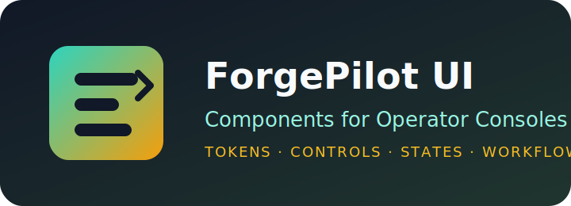

# ForgePilot UI Kit

<p align="center">
  
</p>

面向 Agent 产品、工程控制台和内部运营后台的 React 组件库（TypeScript + Tailwind CSS）。
它服务于 `ForgePilot Studio` 的操作台体验，重点覆盖任务执行、会话轨迹、工具状态、配置治理和团队权限等界面。

---

## 目录

- [1. 项目定位](#1-项目定位)
- [2. 差异化方向](#2-差异化方向)
- [3. 安装与快速接入](#3-安装与快速接入)
- [4. 组件清单](#4-组件清单)
- [5. 版本兼容矩阵](#5-版本兼容矩阵)
- [6. 本地开发](#6-本地开发)
- [7. 发布流程](#7-发布流程)
- [8. 私有化与离线使用](#8-私有化与离线使用)
- [9. 常见问题](#9-常见问题)
- [10. 协议与贡献](#10-协议与贡献)

---

## 1. 项目定位

`ForgePilot UI Kit` 是主仓库的前端组件层，目标是统一以下能力：

- 组件 API 规范：可复用、可组合、可测试。
- 控制台视觉语言：密度适中、信息清晰、适合长期操作。
- Agent 专用状态表达：任务、工具、轨迹、成本、风险、运行时。
- 工程化输出：构建、打包、发布、版本控制和私有 registry 分发。

---

## 2. 差异化方向

当前子项目已完成的品牌化调整：

1. README 改为 ForgePilot 品牌叙述。
2. 替换为自有 Logo 资源（`docs/assets/forgepilot-ui-logo.svg`）。
3. `package.json` 描述、关键词、作者与包名更新为 ForgePilot 命名。
4. 仓库元数据改为 ForgePilot Studio 的仓库地址模板。
5. 文档补充版本兼容、发布检查、离线使用说明。

---

## 3. 安装与快速接入

> 统一命名后的包名：`@forgepilot/ui`。

### 3.1 安装

```bash
# npm
npm install @forgepilot/ui

# yarn
yarn add @forgepilot/ui

# pnpm
pnpm add @forgepilot/ui

# bun
bun add @forgepilot/ui
```

### 3.2 快速接入

```tsx
import { Button, Typography } from "@forgepilot/ui";
import "@forgepilot/ui/styles";

function App() {
  return (
    <div>
      <Typography.H1>ForgePilot UI</Typography.H1>
      <Button variant="primary">开始使用</Button>
    </div>
  );
}
```

---

## 4. 组件清单

| Component | Description |
| --- | --- |
| `Button` | 多状态按钮组件 |
| `Checkbox` | 复选框组件 |
| `Chip` | 标签/状态展示 |
| `Divider` | 分割线 |
| `Icon` | 图标容器 |
| `Input` | 输入框 |
| `InteractiveChip` | 可交互标签 |
| `RadioGroup` | 单选组 |
| `RadioOption` | 单选项 |
| `Scrollable` | 滚动容器 |
| `Toggle` | 开关组件 |
| `Tooltip` | 提示浮层 |
| `Typography` | 标题/正文/代码字体组件 |

---

## 5. 版本兼容矩阵

| 依赖 | 建议版本 |
| --- | --- |
| Node.js | `>=22.0.0` |
| Bun | `>=1.2.0` |
| React | `>=19.1.0` |
| Tailwind CSS | `^4.1.x` |

---

## 6. 本地开发

```bash
cd openhands-ui
bun install
bun run dev
bun run build
```

### 6.1 本地联调（不发布 npm）

```bash
bun run build
bun pm pack
npm install path/to/forgepilot-ui-x.x.x.tgz
```

---

## 7. 发布流程

标准发布入口见：[PUBLISHING.md](./PUBLISHING.md)

发布前建议检查：

1. `bun run build` 成功。
2. Storybook 可正常渲染核心组件。
3. 关键交互组件有最小验证（按钮、输入、提示）。
4. `package.json` 版本与仓库元数据已确认。

---

## 8. 私有化与离线使用

- 方案 A：发布到私有 npm registry（Verdaccio / GitHub Packages）。
- 方案 B：产出 tgz 后通过制品仓库分发。
- 方案 C：在 monorepo 中以 workspace 方式引用。

---

## 9. 常见问题

### Q1：样式没有生效？

确认已引入：

```ts
import "@forgepilot/ui/styles";
```

### Q2：peerDependencies 冲突？

先对齐 `react` / `react-dom` 与 `tailwindcss` 主版本。

### Q3：是否可暂时保留旧包名？

可以。迁移期可通过别名或二次导出做兼容。

---

## 10. 协议与贡献

- 主许可证：`../LICENSE`
- 社区补充协议：`../LICENSE-OPENAGENT-COMMUNITY.md`

欢迎提交新组件、文档增强与测试改进。
