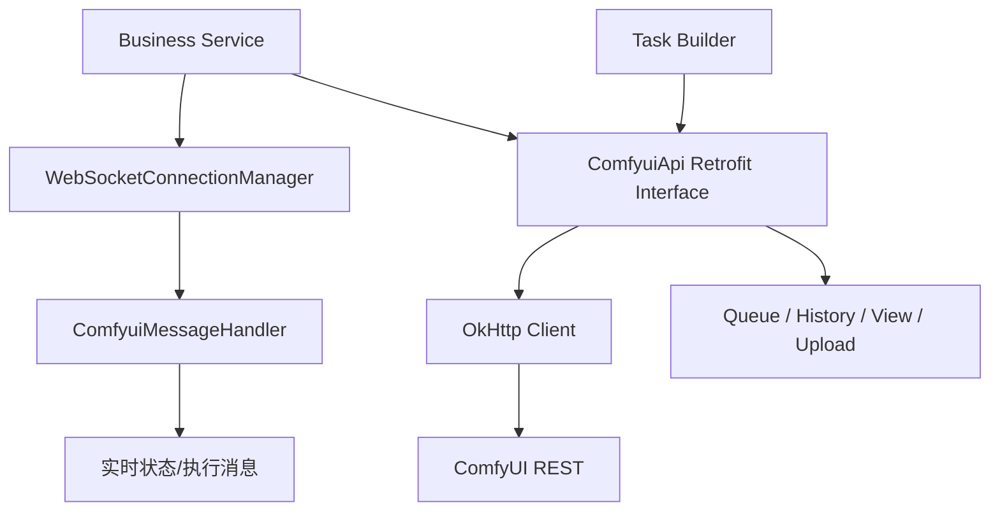

# star-graph - ComfyUI Java 工作流客户端 | ComfyUI Java Workflow Client

🔥 A Java Spring client for ComfyUI based on Retrofit, OkHttp, and WebSocket messaging.  
🚀 Built for reusable REST access, real-time task updates, file transfer, and AI image workflow integration.  
⭐ Provides an engineering-friendly backend access layer for ComfyUI-based generation systems.

> 一个面向 ComfyUI 的 Java/Spring 客户端封装项目。  
> 它以 Retrofit + OkHttp + WebSocket 为核心，把 ComfyUI 常见 REST 与实时消息能力整理成可复用的工程化组件，适合作为 AI 图像工作流系统中的“后端接入层”。

---

## 目录

- 项目背景
- 目标与边界
- 能力清单
- 技术栈
- 架构设计
- 快速开始
- ComfyUI 连接配置
- API 封装矩阵
- 使用示例
- 任务生命周期设计
- 稳定性与可观测性
- 安全与生产建议
- 二次开发指南
- 常见问题（FAQ）
- 路线图

---

## 项目背景

在很多图像生成系统里，ComfyUI 是一个能力强但“接口相对底层”的推理执行器。  
业务系统往往需要的不只是“调用一次 HTTP”，而是完整的以下能力：

1. 对任务队列与历史结果进行结构化访问。  
2. 能上传输入图像、拉取输出图像。  
3. 能实时监听任务执行状态，而不是仅靠轮询。  
4. 能将这些能力融入 Spring 项目的依赖注入体系，便于在服务层复用。  

`star-graph` 就是围绕这些需求构建的“接入层项目”。

---

## 目标与边界

### 目标

- 提供 ComfyUI HTTP API 的统一 Java 封装。  
- 提供 WebSocket 连接管理与消息回调入口。  
- 给出基础的任务提交与查询示例，帮助快速落地。  
- 保持依赖简洁，便于嵌入已有 Spring Boot 服务。

### 当前边界

- 该仓库更偏客户端/SDK，不包含完整业务 Controller。  
- 目前 POJO 设计偏轻量，适合教学与 PoC，生产建议补充强类型模型与错误码处理。  
- WebSocket 消息处理是基础实现，复杂状态机需要业务侧扩展。

---

## 能力清单

- 获取历史任务：`GET /history`  
- 获取单个历史任务：`GET /history/{promptId}`  
- 查询队列：`GET /queue`  
- 删除队列任务：`POST /queue`  
- 获取队列剩余：`GET /prompt`  
- 提交工作流任务：`POST /prompt`  
- 中断当前任务：`GET /interrupt`  
- 获取系统统计：`GET /system_stats`  
- 获取节点信息：`GET /object_info/{nodeName}`  
- 上传图像：`POST /upload/image`  
- 上传蒙版：`POST /upload/mask`  
- 读取预览图：`GET /view`  
- WebSocket 连接监听：`ws://host/ws?clientId=...`

---

## 技术栈

- Java 17  
- Spring Boot 3.2.8  
- Retrofit 2.11.0  
- OkHttp 4.11.0 + Logging Interceptor  
- Jackson Converter  
- Spring WebSocket  
- Hutool / Fastjson2（辅助）

---

## 架构设计



这个架构的关键点是“同步 HTTP + 异步 WebSocket”并存：  
HTTP 用于提交与查询，WebSocket 用于实时状态与执行事件，二者结合可以构建更平滑的任务控制面板。

---

## 快速开始

### 前置条件

- JDK 17+  
- Maven 3.9+  
- 可访问的 ComfyUI 实例（默认 `127.0.0.1:8188`）

### 外部服务依赖说明（必需/可选）

| 服务 | 是否必需 | 默认地址 | 说明 |
|---|---|---|---|
| ComfyUI HTTP | 必需 | `http://127.0.0.1:8188` | 任务提交、历史查询、队列管理 |
| ComfyUI WebSocket | 必需 | `ws://127.0.0.1:8188/ws?clientId=star-graph` | 任务实时状态与执行消息 |
| ComfyUI Workflow 文件 | 必需 | 业务侧提供 | `/prompt` 提交体中的 `prompt` |
| 本仓库 mock 返回 | 可选 | `src/main/resources/mock/comfyui` | 无外部服务时的最小联调样例 |

### 启动方式

```bash
cd star-graph
mvn -DskipTests compile
mvn spring-boot:run
```

启动后会在容器初始化阶段创建：

- `ComfyuiApi` Bean（Retrofit 客户端）  
- `WebSocketConnectionManager` Bean（自动发起 WS 连接）

---

## ComfyUI 连接配置

连接参数已改为配置化（`application.yml` + 环境变量）：

```yaml
comfyui:
  base-url: http://127.0.0.1:8188
  ws-url: ws://127.0.0.1:8188/ws?clientId=star-graph
  connect-timeout-seconds: 30
  http-log-level: BODY
```

支持环境变量覆盖：

- `COMFYUI_BASE_URL`
- `COMFYUI_WS_URL`
- `COMFYUI_CONNECT_TIMEOUT_SECONDS`
- `COMFYUI_HTTP_LOG_LEVEL`

---

## API 封装矩阵

`ComfyuiApi` 已覆盖的主要接口如下：

| 方法 | 路径 | 说明 |
|---|---|---|
| `getHistoryTasks(maxItems)` | `GET /history` | 获取历史任务列表 |
| `getHistoryTask(promptId)` | `GET /history/{promptId}` | 获取单个历史任务 |
| `getQueueTasks()` | `GET /queue` | 查询队列 |
| `deleteQueueTasks(body)` | `POST /queue` | 批量删除队列任务 |
| `getQueueTaskCount()` | `GET /prompt` | 查询队列剩余数量 |
| `addQueueTask(body)` | `POST /prompt` | 提交工作流任务 |
| `interruptTask()` | `GET /interrupt` | 中断当前执行 |
| `getSystemStats()` | `GET /system_stats` | 系统状态 |
| `getNodeInfo(nodeName)` | `GET /object_info/{nodeName}` | 节点元信息 |
| `uploadImage(image)` | `POST /upload/image` | 上传输入图 |
| `uploadMask(...)` | `POST /upload/mask` | 上传蒙版 |
| `getView(...)` | `GET /view` | 拉取预览或输出图 |

---

## 使用示例

### 1) 查询历史任务

```java
HashMap body = comfyuiApi.getHistoryTasks(10).execute().body();
System.out.println(body);
```

### 2) 提交工作流任务

项目测试代码给出了一个图像放大工作流示例：构造 `ComfyuiRequestDto`，将 JSON workflow 作为 `prompt` 提交到 `/prompt`。

```java
ComfyuiRequestDto dto = new ComfyuiRequestDto();
dto.setClientId("star-graph");
dto.setPrompt(JSONUtil.parseObj(workflowJson));
HashMap result = comfyuiApi.addQueueTask(dto).execute().body();
```

### 2.1 最小联调 Mock 示例

在 ComfyUI 暂不可达时，可先用本仓库样例验证解析链路：

```bash
cat src/main/resources/mock/comfyui/prompt_response.json
```

该文件模拟 `/prompt` 成功返回结构，适合前后端最小联调。

### 3) WebSocket 监听

当前 `ComfyuiMessageHandler` 在连接建立与收到消息时打印日志：

- 连接成功回调：`afterConnectionEstablished`  
- 文本消息回调：`handleTextMessage`

实际业务中通常会把消息投递到：

- 内存任务状态表  
- Redis Pub/Sub  
- WebSocket 网关推送给前端

---

## 任务生命周期设计

在典型图像工作流里，建议将任务生命周期抽象为：

1. `CREATED`：业务侧生成任务并落库。  
2. `QUEUED`：调用 `/prompt` 成功并获得 `promptId`。  
3. `RUNNING`：通过 WS 消息识别进入执行态。  
4. `SUCCEEDED`：任务结束，结果可在 `/history/{promptId}` 或 `/view` 获取。  
5. `FAILED`：执行报错，记录错误上下文。  
6. `CANCELED`：业务侧触发 `/interrupt` 或删除队列。  

这样做有三个好处：

- 前端体验更稳定，状态可追踪。  
- 排障时能快速定位失败阶段。  
- 后续做重试策略有明确切入点。

---

## 稳定性与可观测性

### 当前项目已具备

- OkHttp `retryOnConnectionFailure(true)`  
- 连接超时配置（30s）  
- HTTP BODY 级日志输出

### 生产建议

1. 为 Retrofit 调用增加统一异常封装（区分网络失败、业务失败、解析失败）。  
2. 为关键接口增加调用耗时、成功率、重试次数指标。  
3. 避免生产环境长期开启 BODY 日志，防止日志膨胀与敏感内容泄露。  
4. 为 WebSocket 连接加入心跳、断线重连与退避策略。  
5. 增加任务幂等键，避免重复提交导致资源浪费。

---

## 安全与生产建议

- 将 ComfyUI 地址配置化并限制来源网络。  
- 通过 API 网关或服务网格控制访问权限。  
- 上传接口增加文件类型、大小、内容检测。  
- 对外部请求参数做白名单校验（避免注入非法 workflow）。  
- 对任务结果与输入进行审计记录，满足合规需求。  
- 接入密钥管理，不把任何密钥写入代码仓库。

---

## 二次开发指南

### 1) 扩展强类型 DTO

目前部分接口返回 `HashMap`，便于快速验证。  
建议为高频接口逐步替换为强类型响应对象，提升可维护性与编译期安全。

### 2) 抽象服务层

新增 `ComfyTaskService`，封装：

- 任务创建  
- 队列检查  
- 历史查询  
- 输出解析  
- 状态机更新

把控制逻辑从 Controller/测试代码迁移到服务层，有利于测试与复用。

### 3) 引入持久化与消息队列

可将 `promptId` 与业务任务 ID 建立映射并持久化，同时通过 MQ 分发状态事件，实现更可扩展的异步处理架构。

### 4) 增加前端对接协议

定义统一响应结构（任务状态、进度、结果 URL、错误码），让前后端协作更稳定。

---

## 常见问题（FAQ）

### Q1：为什么项目里没有业务 Controller？
该仓库定位为 ComfyUI 客户端接入层，目的是可复用能力而非完整业务应用。

### Q2：WebSocket 只有打印日志，是否太简化？
是的，这是有意保持最小可运行实现。实际项目应把消息转化为任务状态事件并持久化。

### Q3：可以直接用于生产吗？
更适合作为基础骨架。生产前需补齐鉴权、异常模型、监控、重试与限流。

### Q4：如何避免任务重复提交？
建议在业务侧引入幂等键，并在提交前检查任务状态或最近提交记录。

### Q5：如何支持多 ComfyUI 节点？
可把 `ComfyuiApi` 构造成按节点动态路由的客户端工厂，并结合健康检查做负载分配。

---

## 路线图

- [ ] 地址与超时配置化（`application.yml`）  
- [ ] 统一异常模型与错误码  
- [ ] WebSocket 断线重连机制  
- [ ] 强类型响应 DTO 全量替换  
- [ ] 任务状态机与持久化组件  
- [ ] 对外 REST 封装层（面向业务系统）

---

如果你要把 ComfyUI 能力稳定地接入 Java 业务系统，这个仓库可以作为一套清晰、轻量、可扩展的起点。欢迎在此基础上持续演进。

---

## 开源

本项目以开源方式提供，欢迎学习、Fork 与扩展。  
在生产环境使用前，建议补齐鉴权、限流、任务审计、告警与安全治理能力。  
如果团队协作使用，建议同时补充 `LICENSE`、`CONTRIBUTING` 与版本发布说明。